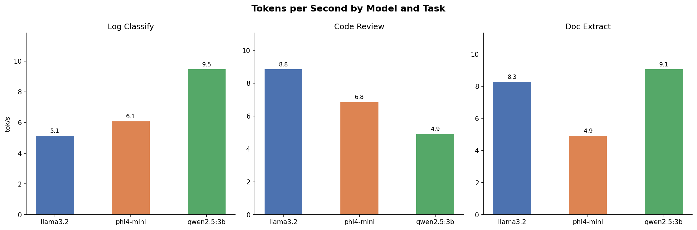
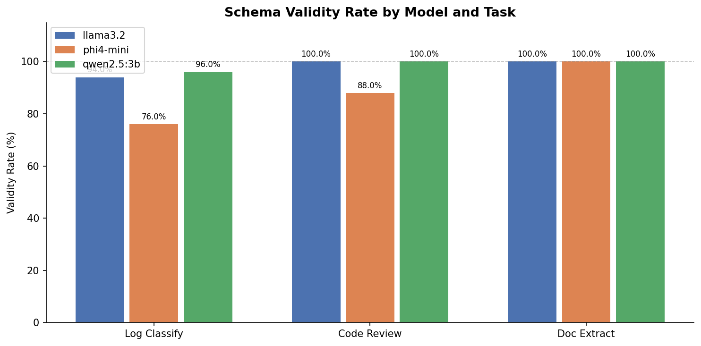
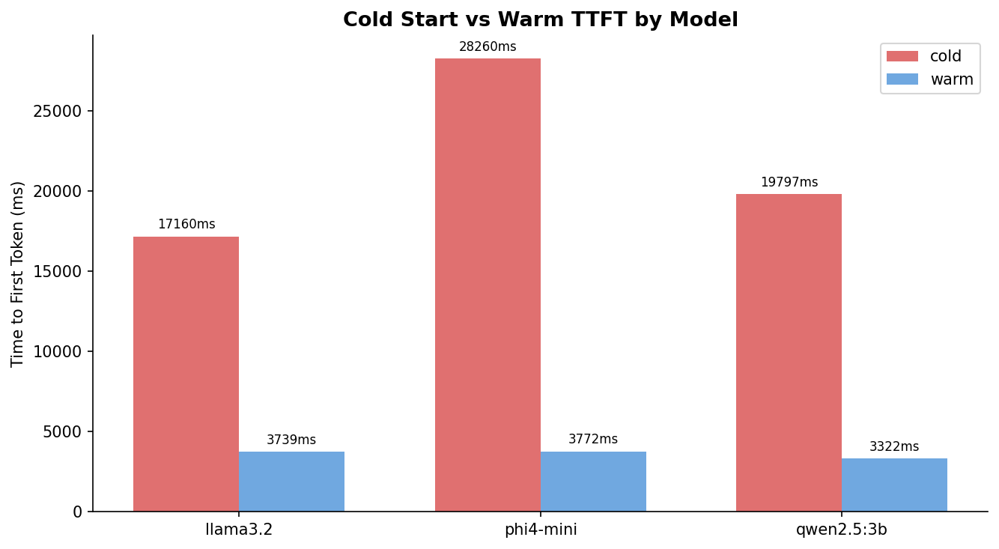
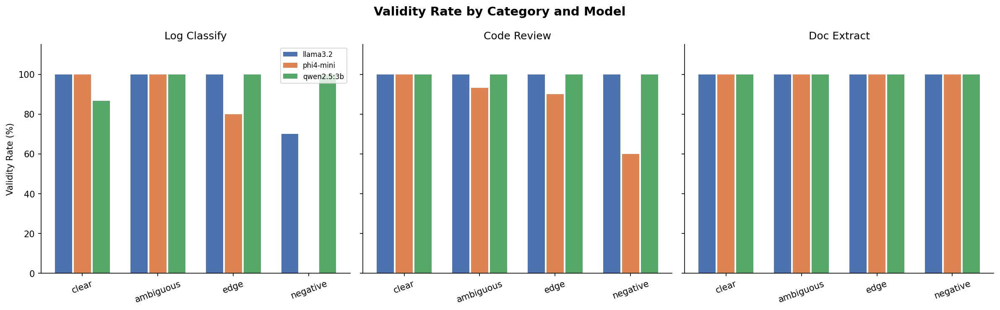

# slm-bench-router


**A data-driven benchmark platform that finds the best local Small Language Model (SLM) for each task -- then routes requests to the winner automatically.**

Most LLM benchmarks test models in isolation with generic metrics. This project goes further: it benchmarks 3 models across 3 real-world tasks, then builds an intelligent router that uses the findings to dispatch every request to the proven best model for that specific task type. No cloud APIs, no API keys, everything runs on your machine.

---

## What This Project Does

1. **Benchmarks 3 local SLMs** (llama3.2, phi4-mini, qwen2.5:3b) on 3 structured tasks
2. **Measures what matters** -- schema validity, inference speed (tok/s), cold vs warm latency
3. **Builds a smart router** -- trained on benchmark data, automatically classifies user input and dispatches to the best model
4. **Exposes a REST API** -- one endpoint for production use (/infer), one for engineering testing (/benchmark)

```
User sends raw text
       |
       v
  RouterAgent (phi4-mini)
  "What kind of task is this?"
       |
       +--- log line?     --> qwen2.5:3b  (96% accuracy, 9.46 tok/s)
       +--- code snippet? --> llama3.2    (100% accuracy, 8.84 tok/s)
       +--- document?     --> qwen2.5:3b  (100% accuracy, 9.05 tok/s)
       |
       v
  Structured JSON response
  (validated against Pydantic schema)
```

---

## How Is This Different?

| Typical LLM Benchmark | This Project |
|---|---|
| Tests models on generic Q&A or MMLU | Tests on **3 real-world structured output tasks** with grammar-constrained JSON |
| Reports a single accuracy number | Measures **schema validity, tok/s, TTFT, cold/warm starts** per model per task |
| Leaves model selection to the user | **Automatically routes** to the best model based on empirical data |
| Runs on cloud APIs (OpenAI, Anthropic) | **100% local** via Ollama -- no API keys, no costs, no data leaving your machine |
| Tests one model at a time | Runs **2,250 inference calls** across all combinations with statistical rigor |
| Prompt-only JSON parsing | Uses **Ollama grammar constraints** (`format: "json"`) for guaranteed valid structure |
| No retry mechanism | **Feeds validation errors back to the model** and retries (max 2), improving success rates |

### The Key Insight

No single model wins everything. Our benchmarks proved it:

- **qwen2.5:3b** dominates log classification and document extraction (speed + accuracy)
- **llama3.2** dominates code review (2x faster than qwen at same 100% accuracy)
- **phi4-mini** underperforms on tasks but has the **best routing accuracy** (94%)

A static "pick one model" approach leaves performance on the table. The router architecture captures the strengths of each model.

---

## Key Findings

### Benchmark Results (2,250 inference calls)

| Task | Best Model | Accuracy | Speed (tok/s) | Runner-up |
|---|---|---|---|---|
| Log Classification | qwen2.5:3b | **96%** (240/250) | **9.46** | llama3.2: 94%, 5.12 tok/s |
| Code Review | llama3.2 | **100%** (250/250) | **8.84** | qwen2.5:3b: 100%, 4.90 tok/s |
| Document Extraction | qwen2.5:3b | **100%** (250/250) | **9.05** | llama3.2: 100%, 8.27 tok/s |

### Router Classification Accuracy (450 inference calls)

| Model | Routing Accuracy | Speed (tok/s) | Schema Validity |
|---|---|---|---|
| phi4-mini | **94.0%** | 6.83 | 99.3% |
| qwen2.5:3b | 92.7% | 9.15 | 100.0% |
| llama3.2 | 90.0% | 8.73 | 100.0% |

### phi4-mini: Bad at Tasks, Best at Routing

phi4-mini performed worst on actual tasks (76% log classification, 88% code review) but scored highest on routing accuracy (94%). Microsoft's reasoning architecture helps with meta-classification even when it struggles with domain-specific structured output. This is why we benchmark before building -- intuition would have picked a different model.

---

## Analysis Charts

### Speed Comparison
How fast each model generates tokens, broken down by task:



### Schema Validity Rate
How often each model produces valid JSON matching the Pydantic schema:



### Cold Start vs Warm TTFT
Time-to-first-token when the model is loading into RAM (cold) vs already loaded (warm):



### Category Breakdown
Pass rates across prompt categories (clear, ambiguous, edge, negative):



---

## Architecture

### Models (3 companies, 3 architectures)

| Model | Parameters | Company | Role in System |
|---|---|---|---|
| llama3.2 | 3B | Meta | Code review specialist |
| phi4-mini | 3.8B | Microsoft | Router (task classifier) |
| qwen2.5:3b | 3B | Alibaba | Log + document specialist |

### Agent System

```
BaseAgent (retry + validation + metrics)
    |
    +-- LogClassifierAgent   --> LogClassification schema
    +-- CodeReviewAgent      --> CodeReviewResult schema
    +-- DocExtractorAgent    --> DocumentMetadata schema
    +-- RouterAgent          --> RouterDecision schema
                                    |
                                    +--> dispatches to specialized agent
```

Every agent:
- Calls Ollama with streaming (captures TTFT accurately)
- Validates response against a Pydantic v2 schema
- On failure, feeds the validation error back to the model and retries (max 2)
- Returns structured `AgentResult` with data + timing metrics

### Retry with Error Feedback

When a model returns invalid JSON, we don't just retry blindly. We tell the model what went wrong:

```
Your previous attempt failed validation:
  - severity: value is not a valid enumeration member; permitted: 'low', 'medium', 'high', 'critical'
Try again.
```

This increases recovery rates significantly -- models can self-correct when given specific error context.

### Benchmark Design

- **150 test prompts** (50 per task) across 4 difficulty categories:
  - **Clear** (15): unambiguous cases every model should handle
  - **Ambiguous** (15): borderline inputs where models diverge
  - **Edge** (10): malformed, empty, or unusual formats
  - **Negative** (10): inputs that are NOT the target task (tests false positive rate)
- **5 runs per prompt per model** (run 1 = cold start, runs 2-5 = warm)
- **Total: 2,250 inference calls** for task benchmarks + 450 for router evaluation

---

## API Endpoints

| Endpoint | Method | Purpose |
|---|---|---|
| `/health` | GET | Server alive check |
| `/models` | GET | List available models and router mapping |
| `/infer` | POST | **Production endpoint** -- auto-classifies and routes to best model |
| `/benchmark` | POST | **Testing endpoint** -- forces specific task + model combination |

### Interactive Testing

Start the server and open **http://localhost:8000/docs** for Swagger UI -- click any endpoint, fill in the body, click Execute. No curl needed.

### Example: /infer (Router Mode)

```json
// Request
POST /infer
{"input": "[ERROR] Connection pool exhausted. Max retries exceeded for host db-primary-01"}

// Response
{
  "task_type": "log_classify",
  "model_used": "qwen2.5:3b",
  "router_confidence": 0.95,
  "router_reasoning": "Input is a server error log line",
  "success": true,
  "data": {
    "anomaly_type": "database",
    "severity": "high",
    "confidence": 0.92,
    "explanation": "Connection pool exhaustion indicates database connectivity issues"
  },
  "retry_count": 0,
  "ttft_ms": 280.5,
  "tokens_per_sec": 9.46,
  "total_ms": 620.3,
  "routing_ms": 800.1
}
```

### Example: /benchmark (Manual Mode)

```json
// Request
POST /benchmark
{"task": "code_review", "model": "llama3.2", "input": "def get_user(id): return db.query(f'SELECT * FROM users WHERE id={id}')"}

// Response
{
  "task": "code_review",
  "model": "llama3.2",
  "success": true,
  "data": {
    "issue_type": "security",
    "severity": "critical",
    "line_number": 1,
    "suggestion": "Use parameterized queries to prevent SQL injection",
    "confidence": 0.98
  },
  "retry_count": 0,
  "tokens_per_sec": 8.84,
  "total_ms": 720.6
}
```

---

## Project Structure

```
slm-bench-router/
|-- config.py                    # all configuration in one place
|-- requirements.txt             # Python dependencies
|-- report.md                    # detailed technical report
|
|-- schemas/                     # Pydantic v2 output contracts
|   |-- log_classification.py    # LogClassification
|   |-- code_review.py           # CodeReviewResult
|   |-- doc_extraction.py        # DocumentMetadata
|   |-- router.py                # RouterDecision
|
|-- agents/                      # agent implementations
|   |-- base_agent.py            # BaseAgent (retry, validation, metrics)
|   |-- log_classifier_agent.py
|   |-- code_review_agent.py
|   |-- doc_extractor_agent.py
|   |-- router_agent.py          # classify + dispatch
|
|-- benchmark/
|   |-- harness.py               # benchmark runner (50 prompts x 5 runs)
|   |-- router_eval.py           # router accuracy evaluation
|   |-- test_prompts/            # 150 labeled test cases
|   |-- results/                 # CSVs + PNG charts
|
|-- api/
|   |-- main.py                  # FastAPI app, /health, /models
|   |-- routes/
|       |-- infer.py             # POST /infer (router mode)
|       |-- benchmark.py         # POST /benchmark (manual mode)
|
|-- analysis/
|   |-- compare.ipynb            # Jupyter notebook for visualization
```

---

## Getting Started

### Prerequisites

- **Python 3.11+** -- [python.org/downloads](https://www.python.org/downloads/)
- **Ollama** -- [ollama.com/download](https://ollama.com/download)
- **~8 GB free RAM** -- all 3 models loaded simultaneously use ~6.3 GB

### Step 1: Clone the Repository

```bash
git clone https://github.com/kirtanpathak4/slm-bench-router.git
cd slm-bench-router
```

### Step 2: Create Virtual Environment

```bash
# Windows
python -m venv .venv
.venv\Scripts\activate

# macOS / Linux
python3 -m venv .venv
source .venv/bin/activate
```

### Step 3: Install Dependencies

```bash
pip install -r requirements.txt
```

### Step 4: Start Ollama and Pull Models

Open a separate terminal:
```bash
ollama serve
```

In another terminal, pull the 3 models (one-time download):
```bash
ollama pull llama3.2
ollama pull phi4-mini
ollama pull qwen2.5:3b
```

### Step 5: Run the API

```bash
# Windows (PowerShell)
$env:PYTHONUTF8=1; .venv\Scripts\python.exe -m uvicorn api.main:app --port 8000

# macOS / Linux
PYTHONUTF8=1 python -m uvicorn api.main:app --port 8000
```

Open **http://localhost:8000/docs** in your browser for the interactive Swagger UI.

### Step 6: Test It

In Swagger UI (http://localhost:8000/docs):

1. Click **POST /infer** > **Try it out**
2. Paste this body:
```json
{"input": "[ERROR] Connection pool exhausted. Max retries exceeded for host db-primary-01"}
```
3. Click **Execute**
4. See the full response with task classification, model used, structured data, and timing

Try different inputs:
```json
{"input": "def get_user(id): return db.query(f'SELECT * FROM users WHERE id={id}')"}
```
```json
{"input": "Invoice #4521  Vendor: Acme Corp  Amount: $1,200  Due: 2026-04-01"}
```

### Step 7 (Optional): Run Benchmarks Yourself

Run all 9 task benchmark combinations (takes ~45 minutes):
```bash
# Windows (PowerShell)
$env:PYTHONUTF8=1; .venv\Scripts\python.exe -m benchmark.harness --task all --model all

# macOS / Linux
PYTHONUTF8=1 python -m benchmark.harness --task all --model all
```

Run router accuracy evaluation:
```bash
# Windows (PowerShell)
$env:PYTHONUTF8=1; .venv\Scripts\python.exe -m benchmark.router_eval

# macOS / Linux
PYTHONUTF8=1 python -m benchmark.router_eval
```

### Step 8 (Optional): Generate Analysis Charts

```bash
# Windows (PowerShell)
$env:PYTHONUTF8=1; .venv\Scripts\python.exe -m jupyter notebook analysis/compare.ipynb

# macOS / Linux
PYTHONUTF8=1 python -m jupyter notebook analysis/compare.ipynb
```

Run all cells (Kernel > Restart & Run All). Charts save to `benchmark/results/`.

---

## Configuration

All tunable settings live in `config.py`:

```python
OLLAMA_URL = "http://localhost:11434"
MODELS = ["llama3.2", "phi4-mini", "qwen2.5:3b"]
MAX_RETRIES = 2
DEFAULT_TEMPERATURE = 0.0
BENCHMARK_RUNS = 5

ROUTER_MODEL = "phi4-mini"        # 94% routing accuracy
ROUTER_MODEL_MAP = {
    "log_classify": "qwen2.5:3b", # 96% accuracy, 9.46 tok/s
    "code_review": "llama3.2",    # 100% accuracy, 8.84 tok/s
    "doc_extract": "qwen2.5:3b",  # 100% accuracy, 9.05 tok/s
}
```

To swap in a different model:
1. `ollama pull <model_name>`
2. Update `MODELS` list in config.py
3. Re-run benchmarks: `python -m benchmark.harness --task all --model <model_name>`
4. Update `ROUTER_MODEL_MAP` with new winners

---

## Why This Matters

**Local inference is the future for sensitive workloads.** Healthcare, finance, government -- any domain where data cannot leave the premises. But which 3B model do you pick? Marketing benchmarks from model providers are biased. Generic leaderboards test capabilities you don't need.

This project proves a practical methodology:
1. Define your actual tasks with Pydantic contracts
2. Build a diverse prompt set (clear + ambiguous + edge + negative)
3. Run every model on every task with statistical rigor (5 runs, cold/warm tracking)
4. Let the data pick the winner -- then automate the routing

The result: a system that's measurably better than any single model, running entirely on consumer hardware with no cloud dependencies.

---

## Tech Stack

| Technology | Why |
|---|---|
| Python 3.11+ | Native `str \| None` unions, performance improvements |
| Ollama | Local model runtime, no API keys, grammar-constrained JSON output |
| FastAPI | Auto Swagger UI, async, Pydantic integration |
| Pydantic v2 | Schema validation, Literal types, 5-50x faster than v1 |
| httpx | Streaming HTTP for accurate TTFT measurement |
| pandas + matplotlib | Benchmark data analysis and visualization |
| Jupyter | Interactive analysis notebook |

---

## License

MIT
